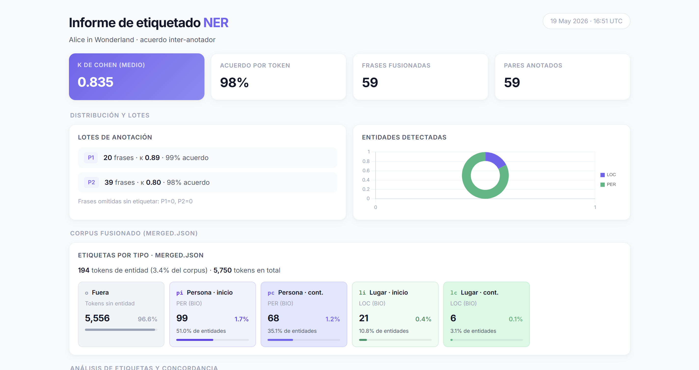
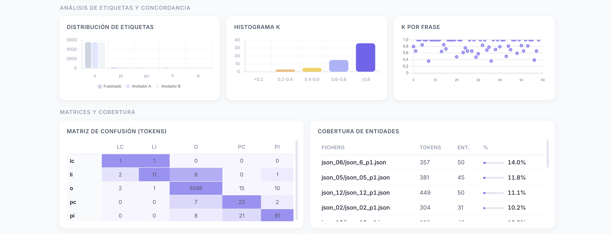
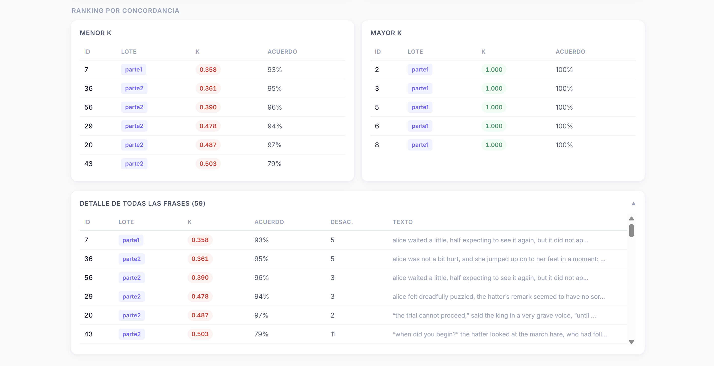

# METADATOS DE ANOTACIÓN · PREENTREGA P5 · Grupo 1 de etiquetado

## Corpus

El corpus utilizado para esta preentrega se construyó a partir de fragmentos literarios almacenados en los ficheros:

```text
corpus_original/alice_in_wonderland.txt
corpus_original/looking_glass.txt
```

La generación automática de frases para anotación se realizó principalmente sobre el contenido de `alice_in_wonderland.txt`, a partir del cual se seleccionaron distintos fragmentos que posteriormente fueron distribuidos entre los anotadores del grupo.

Las frases fueron extraídas automáticamente mediante scripts específicos de preparación de datos y repartidas posteriormente en múltiples ficheros JSON para permitir anotación manual distribuida y doble anotación por frase.

Toda la lógica de generación de plantillas y distribución de frases se implementó principalmente en:

```text
scripts/templates.py
```

El objetivo del corpus no era construir un dataset masivo, sino disponer de un conjunto pequeño pero consistente y suficientemente estructurado como para poder entrenar, evaluar y analizar posteriormente un modelo de reconocimiento de entidades nombradas (NER).

---

# Objetivo de la anotación

El propósito principal de esta preentrega ha sido construir manualmente un corpus etiquetado para tareas de reconocimiento de entidades nombradas (Named Entity Recognition, NER).

Concretamente, se decidió trabajar inicialmente con dos tipos principales de entidades:

- entidades de persona/personaje;
- entidades de localización.

Además de generar un corpus utilizable posteriormente durante entrenamiento y evaluación, también se buscó reproducir un flujo de trabajo similar al utilizado en proyectos reales de anotación colaborativa.

Para ello, el proceso completo se diseñó de forma que permitiera:

- realizar doble anotación sobre cada frase;
- medir acuerdo inter-anotador;
- detectar inconsistencias;
- aplicar reglas automáticas de resolución de conflictos;
- generar métricas automáticas;
- y construir finalmente un corpus fusionado y consistente.

El objetivo final era disponer de un dataset reutilizable para las siguientes fases de la práctica, especialmente el entrenamiento y evaluación de un modelo NER implementado desde cero.

---

# Participantes

El proceso de anotación se realizó de manera colaborativa entre los distintos integrantes del grupo.

| JSON | Anotador |
|---|---|
| json_01 | Pablo Alonso Romero |
| json_02 | Rodrigo Jesús-Portanet Martínez |
| json_03 | Carlota Salazar Martín |
| json_04 | Bautista Pelossi Schweizer |
| json_05 | Ignacio Ramírez Suárez |
| json_06 | Bryan Xavier Quilumba Farinango |
| json_07 | Carlos Mantilla Mateos |
| json_08 | Javier Martín Fuentes |
| json_09 | João Francisco Sampaio Pereira |
| json_10 | Yushan Yang Xu |
| json_11 | María Romero Huertas |
| json_12 | Marina Triviño de las Heras |
| json_13 | Carmen Fernández González |

Cada anotador participó tanto en la primera como en la segunda fase de anotación (`p1` y `p2`).

---

# Organización general de la anotación

El corpus se dividió en dos partes independientes de anotación:

- `parte1`
- `parte2`

Cada una de estas partes contiene 13 ficheros JSON distintos, uno por anotador.

Para organizar correctamente el trabajo entre todos los integrantes del grupo, se decidió que cada frase apareciese exactamente en dos JSON diferentes. De esta forma, cada fragmento sería anotado por dos personas distintas, permitiendo posteriormente comparar resultados y medir el acuerdo entre anotadores mediante métricas como κ de Cohen.

Toda la lógica utilizada para generar automáticamente las frases, repartirlas entre los distintos JSON y construir las plantillas de anotación se implementó en:

```text
scripts/templates.py
```

En la segunda fase del corpus se generaron automáticamente 13 JSON con 6 frases por fichero. Como cada frase debía aparecer exactamente dos veces, esto produjo:

- 78 huecos de anotación;
- 39 frases distintas.

Además, se decidió filtrar automáticamente las frases demasiado cortas, manteniendo únicamente aquellas con al menos 20 palabras. Esta decisión se tomó porque los fragmentos muy pequeños apenas contenían entidades útiles y ofrecían poco contexto para una tarea NER.

El objetivo era trabajar con ejemplos más completos y naturales, que incluyesen:

- mayor contexto semántico;
- más interacción entre personajes;
- y una mayor presencia potencial de entidades.

Posteriormente, una vez finalizada la anotación manual, las distintas versiones anotadas de cada frase se fusionaron automáticamente utilizando scripts específicos implementados en:

```text
scripts/etiquetados.py
scripts/merge.py
```

Estos scripts se encargan de:

- localizar las frases anotadas por cada pareja de anotadores;
- comparar etiquetas;
- resolver automáticamente conflictos simples;
- calcular métricas de acuerdo;
- y generar finalmente un corpus fusionado listo para entrenamiento.

---

# Formato de anotación

Cada fichero JSON anotado contiene una lista de objetos con la siguiente estructura:

```json
{
  "clave": "Alice",
  "valor": "pi"
}
```

En este formato:

- `clave` representa la unidad textual anotada;
- `valor` representa la etiqueta asignada por el anotador.

La tokenización utilizada durante el proceso de anotación se realizó separando palabras, espacios y signos de puntuación como unidades independientes. Aunque esto produce secuencias más largas, permite conservar una correspondencia exacta con el texto original y simplifica posteriormente tanto la reconstrucción del texto como la alineación entre tokens y etiquetas.

La anotación no se realizó sobre palabras normalizadas o procesadas previamente, sino directamente sobre las unidades originales presentes en el texto. Esto permitió mantener una trazabilidad completa entre corpus y anotaciones, algo especialmente útil durante las fases posteriores de fusión, análisis y entrenamiento del modelo.

Toda la preparación de plantillas y estructuras de anotación se implementó mediante los scripts definidos en:

```text
scripts/templates.py
```

---

# Etiquetas utilizadas

Para la anotación se utilizó un esquema inspirado en BIO, aunque simplificado y adaptado específicamente a las necesidades de la práctica.

El objetivo no era reproducir exactamente un estándar industrial completo, sino trabajar con un conjunto pequeño de etiquetas que permitiese implementar manualmente todo el pipeline, desde la anotación hasta el entrenamiento y evaluación del modelo.

Las etiquetas utilizadas fueron las siguientes:

| Etiqueta | Significado |
| --- | --- |
| `o` | fuera de entidad |
| `pi` | inicio de entidad de persona/personaje |
| `pc` | continuación de entidad de persona/personaje |
| `li` | inicio de entidad de localización |
| `lc` | continuación de entidad de localización |

La correspondencia aproximada con BIO estándar sería:

- `pi` ≈ `B-PER`
- `pc` ≈ `I-PER`
- `li` ≈ `B-LOC`
- `lc` ≈ `I-LOC`
- `o` ≈ `O`

Este esquema simplificado resultó suficiente para representar correctamente las entidades presentes en el corpus y facilitó bastante el desarrollo de las fases posteriores del proyecto.

---

# Decisiones de anotación

Durante el proceso de anotación se tomaron varias decisiones importantes para mantener consistencia entre anotadores.

## Entidades de persona

Se etiquetaron como entidades de persona:

- personajes;
- personas mencionadas explícitamente;
- nombres propios asociados a individuos.

Ejemplos:

- Alice
- Queen
- Hatter
- Dormouse

## Entidades de localización

Se etiquetaron como localización:

- lugares explícitos;
- escenarios relevantes;
- espacios narrativos importantes.

Debido al tamaño relativamente reducido del corpus, también se decidió aceptar algunas localizaciones sin nombre propio cuando tenían relevancia contextual clara dentro de la narración.

Esta decisión se tomó para evitar un corpus excesivamente pobre en entidades de tipo LOC.

## Conservación de espacios y puntuación

Los espacios y signos de puntuación se conservaron como tokens independientes. Aunque esta decisión produce secuencias más largas, permite:

- mantener correspondencia exacta con el texto;
- simplificar alineación posterior;
- facilitar reconstrucción de spans;
- evitar errores de offset.

## Normalización automática

Durante la fase de fusión se normalizaron automáticamente:

- etiquetas vacías;
- errores tipográficos menores;
- etiquetas inválidas.

Por ejemplo:

```text
ps → pi
```

Cualquier etiqueta desconocida se convertía automáticamente en `o`.

---

# Organización de los anotadores

Cada JSON fue anotado por dos personas distintas. Esto permitió disponer de doble anotación sobre todas las frases y medir así consistencia entre anotadores.

Las asignaciones completas se encuentran en:

```text
asignaciones/
```

Estas asignaciones indican qué frases aparecían en cada JSON, qué anotadores participaron y cómo se distribuyó el trabajo entre los distintos miembros del grupo.

---

# Fusión automática de anotaciones

Una vez completada la fase de anotación manual, todas las anotaciones generadas por los distintos participantes se fusionaron automáticamente mediante scripts específicos desarrollados para la práctica.

El objetivo de esta fase era transformar las múltiples versiones anotadas de cada frase en un único corpus consistente y utilizable posteriormente durante el entrenamiento del modelo NER.

El proceso de fusión comienza cargando las asignaciones de frases y localizando automáticamente qué anotadores habían trabajado sobre cada fragmento. A partir de ahí, los scripts extraen los tokens y etiquetas correspondientes, comparan las distintas anotaciones y calculan métricas de acuerdo entre anotadores.

Además, antes de fusionar definitivamente las etiquetas, el sistema aplica varias reglas de normalización y resolución automática de conflictos. Por ejemplo:

- corregir etiquetas inválidas o inconsistentes;
- ajustar continuaciones de entidad sin inicio previo;
- priorizar entidades frente a etiquetas `o` en algunos conflictos;
- reconstruir correctamente secuencias BIO simplificadas.

Finalmente, el proceso genera un corpus fusionado (`merged.json`) que contiene únicamente la información necesaria para entrenamiento y análisis posterior.

La implementación principal de esta lógica se encuentra en:

```text
scripts/etiquetados.py
scripts/merge.py
```

---

# Formato del corpus fusionado

El resultado final de la fusión se almacena en:

```text
merged.json
```

Cada entrada contiene:

```json
{
  "frase_id": 0,
  "text": "...",
  "tokens": ["...", "..."],
  "labels": ["o", "pi", "..."]
}
```

Este formato se diseñó específicamente para facilitar:

- entrenamiento posterior;
- evaluación;
- visualización;
- análisis;
- y trazabilidad entre texto y etiquetas.

La implementación de guardado se encuentra en:

```text
scripts/dataset.py
```

---

# Resolución de conflictos

Como era esperable en un proceso de anotación manual realizado por múltiples personas, aparecieron pequeñas discrepancias entre anotadores. Para evitar tener que corregir manualmente todos los casos, se implementó un sistema automático de resolución de conflictos basado en varias reglas heurísticas sencillas.

El objetivo principal de esta fase era obtener un corpus final coherente y consistente, incluso cuando existiesen diferencias menores entre anotaciones.

Las reglas aplicadas fueron las siguientes:

1. Si ambos anotadores coincidían, se conservaba directamente la etiqueta.
2. Si ambos anotaban `o`, el resultado final era `o`.
3. Si uno de los anotadores marcaba una entidad y el otro `o`, se priorizaba la entidad.
4. Si ambos anotaban entidades del mismo tipo, se mantenía ese tipo de entidad.
5. Si aparecía una continuación sin un inicio previo válido, el sistema corregía automáticamente la secuencia.
6. Cuando se detectaba un cambio de entidad, el span se reiniciaba automáticamente.
7. En conflictos más ambiguos, se utilizaba la entidad no-`o` más frecuente.

Estas reglas permitieron automatizar gran parte del proceso de limpieza y generar un corpus suficientemente consistente para entrenamiento posterior.

La implementación principal de esta lógica se encuentra en:

```text
scripts/merge.py
```

Concretamente, las funciones más importantes son:

- `normalize_merge_label`
- `coerce_bio_label`
- `merge_disagreeing_labels`
- `merge_sentence_labels`

---

# Cálculo de acuerdo inter-anotador

Para medir la calidad del corpus anotado se calcularon distintas métricas.

La principal fue κ de Cohen, utilizada para medir el acuerdo entre dos anotadores descontando coincidencias debidas al azar.

La fórmula utilizada fue:

```text
κ = (acuerdo_observado - acuerdo_esperado) / (1 - acuerdo_esperado)
```

Además, también se calcularon:

- acuerdo medio por token;
- κ por frase;
- κ medio global;
- matrices de confusión;
- distribuciones de etiquetas;
- cobertura de entidades.

La implementación principal de estos cálculos se encuentra en:

```text
scripts/merge.py
```

---

# Resultados obtenidos

Una vez finalizado el proceso de anotación y fusión automática, se generó un informe visual en HTML con distintas métricas y gráficos para analizar la calidad del corpus anotado.

El objetivo de este informe era comprobar:

- el nivel de acuerdo entre anotadores;
- la distribución de entidades dentro del corpus;
- la consistencia de las etiquetas;
- y la calidad general del dataset generado.

El informe se generó automáticamente mediante los scripts:

```text
scripts/report.py
scripts/report_html.py
```

y produce el fichero:

```text
informe_etiquetado.html
```

---

## Métricas globales

Los resultados globales obtenidos fueron los siguientes:

- κ de Cohen medio: **0.835**
- acuerdo medio por token: **98%**
- frases fusionadas: **59**
- pares de anotación evaluados: **59**

Estos valores indican un nivel de acuerdo alto entre anotadores. En particular, un κ superior a 0.8 suele considerarse una señal de consistencia fuerte en tareas de anotación manual.

El acuerdo por token también resulta especialmente elevado, lo que sugiere que las discrepancias entre anotadores fueron relativamente pequeñas y localizadas.



---

## Distribución de entidades

El informe también permite visualizar la distribución de etiquetas dentro del corpus fusionado (`merged.json`).

En total, el corpus contiene:

- **5750 tokens**
- **194 tokens de entidad**
- aproximadamente un **3.4%** del corpus etiquetado como entidad.

La mayoría de entidades corresponden a personajes (`PER`), algo esperable debido al carácter narrativo de *Alice in Wonderland*. Las entidades de localización (`LOC`) aparecen con menor frecuencia, aunque siguen siendo suficientes para permitir entrenamiento y evaluación básica del modelo.

Además, el informe muestra la proporción de etiquetas:

- `pi` y `pc` para entidades de persona;
- `li` y `lc` para entidades de localización;
- y `o` para tokens fuera de entidad.



---

## Acuerdo inter-anotador

Uno de los objetivos principales de la práctica era medir la consistencia entre anotadores.

Para ello se calcularon distintas métricas:

- κ de Cohen por frase;
- histogramas de distribución de κ;
- acuerdo por token;
- y matrices de confusión entre etiquetas.

El histograma muestra que la mayoría de frases presentan valores de κ superiores a 0.8, indicando un acuerdo elevado en gran parte del corpus.

También se identificaron algunas frases con menor acuerdo. Estas discrepancias suelen aparecer en:

- delimitación de entidades largas;
- interpretación contextual de localizaciones;
- o diferencias pequeñas entre inicio (`i`) y continuación (`c`) de entidad.

La matriz de confusión permite observar visualmente qué tipos de errores fueron más frecuentes entre anotadores.



---

# Informe visual generado

A partir de las anotaciones fusionadas se generó automáticamente un informe HTML:

```text
informe_etiquetado.html
```

Este informe incluye:

- distribución de etiquetas;
- histogramas de κ;
- matrices de confusión;
- cobertura de entidades;
- ranking de frases;
- métricas globales;
- y distintas visualizaciones gráficas.

El procesamiento estadístico se implementa en:

```text
scripts/report.py
```

Mientras que la construcción visual del HTML se implementa en:

```text
scripts/report_html.py
```

---

# Comentarios finales

La fase de preentrega permitió construir un corpus anotado manualmente suficientemente consistente como para utilizarse posteriormente durante el entrenamiento y evaluación del modelo NER de la práctica.

Además del propio dataset, el proceso sirvió también para implementar y validar distintas partes importantes del pipeline de trabajo: generación automática de plantillas, distribución de anotaciones, cálculo de acuerdo inter-anotador, resolución automática de conflictos y generación de informes de calidad.

La principal dificultad apareció en la delimitación de ciertas localizaciones dentro de un corpus literario, especialmente en referencias espaciales ambiguas o poco explícitas. Aun así, las métricas obtenidas muestran un nivel de acuerdo elevado entre anotadores y sugieren que los criterios utilizados fueron razonablemente coherentes.

El resultado final es un corpus pequeño pero estructurado, reutilizable y completamente integrado con el resto de herramientas desarrolladas para la práctica.

Este corpus queda preparado para las siguientes fases del proyecto:

- entrenamiento del modelo NER;
- evaluación;
- experimentación;
- ajuste de hiperparámetros;
- y análisis posterior de resultados.
